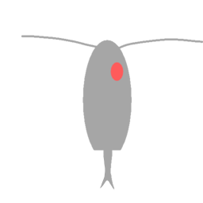

<h1 align = "center">Plankton</h1>
A simple Java engine that uses the UCI protocol.

## Run

To run the engine, type `./gradlew jar` to create a jar located in the `build/libs/` directory, which you can run
with `java -jar build/libs/Plankton.jar`.

## Features

- Minimax
- Alpha-Beta pruning
- Piece-Square tables
- Quiescence search
- Static Exchange Evaluation

## Todo List

- Better eval
- Magic Bitboards
